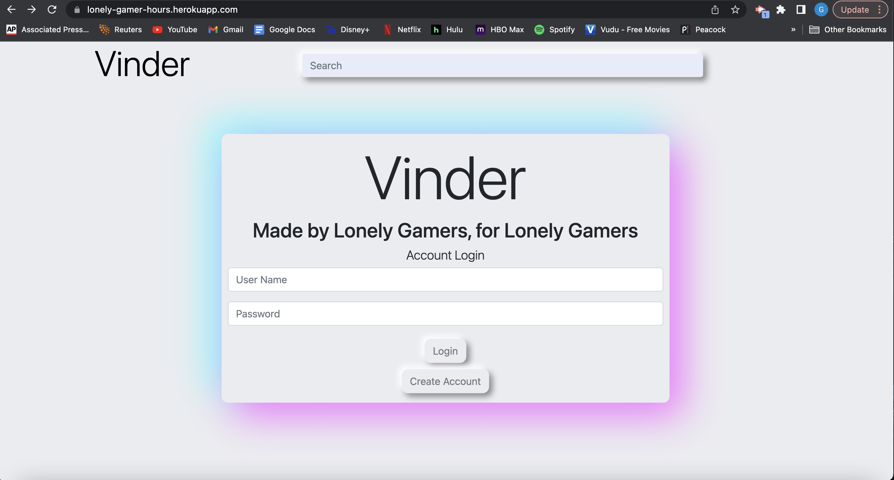

# Vinder
----------------------------------------------------------------
## Description
Vinder is a full-stack web application designed for gamers who want to connect to other players, find friends to hop on with, and discuss their favorite games.
This project was a collaboration between 
- Michael Stolley (MikeStolley), 
- Griffin Honeycutt (fghoneycutt), 
- Sam Rebilas (SamRebilas), 
- Alex Rodriguez (rodriguez531),
- Farrell DiAnni (farrelldianni).

## Tech Stack
- Javascript
- Handlebars 
- SQL/ Sequelize 
- Anime.js

## Future Development
Complete project functionality
- Log in
- Create posts
- Populate homepage with posts from the database

Adding the ability for users to look through a genre of game they are interested in.

Add ability for users to direct message other account holders and friend request.

Full profile page 

Add ability to search for a specific game

## Link
https://lonely-gamer-hours.herokuapp.com/

## Screenshot
